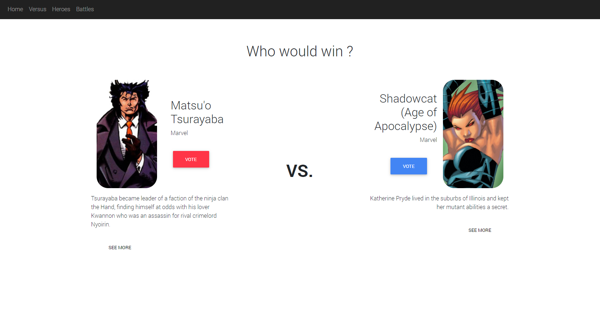

# Angular Hero polls
Ce projet d'Angular consiste à afficher les nombreux héros de chez Marvel, en connaître les relations, et surtout les faire s'affronter dans des sondages web !

### Mockup Intéractif avant production:
Visualisez [ici mon mockup intéractif](https://xd.adobe.com/view/91792b1b-04df-4777-7424-491856343f5d-e748/) 


## Features :
- Navigation parmis tous les héros disponibles
- Mode versus : combats-sondages 100% aléatoires !
   - Votez pour le héros qui gagnerait selon vous
   - Visualisez les pourcentages des votes de la communauté
- Visualisation des détails d'un héros: description, relations...
- Archive des combats-sondages enregistrés et possibilité d'y laisser son vote !

## Installation

Pour procéder à l'installation,

```bash
cd hero-polls
npm install
```


## Utilisation
Afin de profiter de l'ensemble des fonctionnalités du projet, le serveur json-server doit-être lancé en tandem.
Il faut aussi lancer le serveur angular.

Tout ceci est géré par une commande concurrente simple, qui se charge de tout lancer : 

```bash
npm start
```
Le lancement des serveurs json et Angular prend environ 30 secondes. Merci d'être patient.


Vous saurez que tout est bon lorsque la console affiche ceci:
```bash
...
[1]   Other routes
[1]   /localapi/* -> /$1
[1]
[1]   Home
[1]   http://localhost:3000
[1]
...
[0] ** Angular Live Development Server is listening on localhost:4200, open your browser on http://localhost:4200/ **
[0] : Compiled successfully.
```

Il n'y a plus qu'à se connecter sur http://localhost:4200/

(Pour terminer les processus, appuyer deux fois sur Ctrl-C )

## Pages
### Page d'accueil :


### Page Versus :
Deux héros sont affichés aléatoirement. A vous de voter pour celui qui gagnerait un combat un contre un !



### Page Héros : 
Visualisez ici tous les héros proposés par les API utilisées (couramment : Marvel)


 - Page Details d'un Héro :
 Affiche la description, abilités et relations d'un héros.
 

### Page archive des sondages :
Affiche les combats-sondages déjà enregistrés sur le json-server, et donne la possibilité d'y participer !


### Précisions
Projet réalisé dans le cadre d'un devoir d'Angular,
appels effectués de façon asynchrone.
- Utilisation de l'API [Marvel](https://developer.marvel.com/) Tous droits réservés.
- Utilisation aussi d'une API REST sur serveur local par le biais de json-server pour le stockage des sondages. (disponible sur le port 3000)
